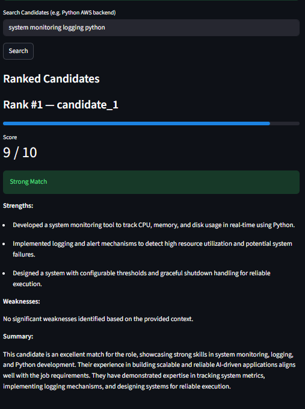
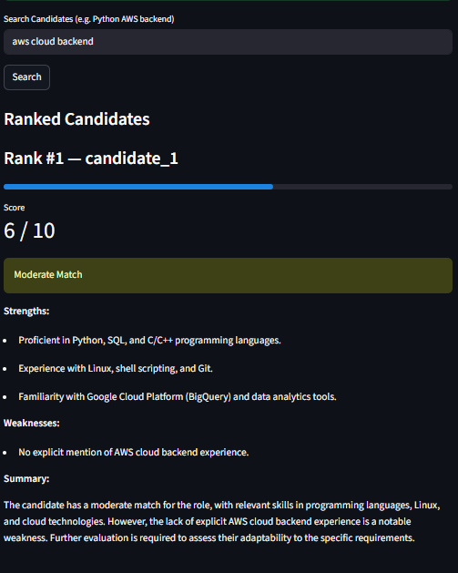
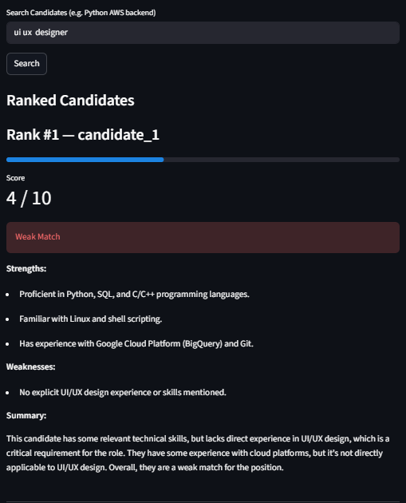

# HireSense RAG — AI-Powered Candidate Search & Evaluation System

HireSense RAG is a Retrieval-Augmented Generation (RAG) based system that enables semantic candidate search and intelligent evaluation of resumes using Large Language Models (LLMs).

Unlike traditional keyword-based filtering, this system understands **context, intent, and relevance**, making candidate screening more accurate and scalable.

---

## 🚀 Features

- 🔍 **Semantic Resume Search**
  - Query candidates using natural language (e.g., *"Python backend with testing experience"*)

- 🧩 **Resume Parsing & Chunking**
  - Extracts and splits resumes into meaningful chunks for better retrieval

- ⚡ **Vector Search (FAISS)**
  - Stores embeddings for efficient similarity search

- 🧠 **LLM-Based Candidate Evaluation**
  - Generates:
    - Score (0–10)
    - Strengths
    - Weaknesses
    - Summary

- 📊 **Decision-Aware Ranking**
  - Penalizes missing critical skills (e.g., AWS for cloud roles)

- 🧪 **Robust Edge Case Handling**
  - Handles:
    - Strong matches
    - Partial matches
    - Completely unrelated roles

---

## 🏗️ System Architecture

```

Resume → Parser → Chunker → Embedder → FAISS Index
Query → Embedder → Retriever → Context Builder → LLM → Ranking Output

```

---

## 🖥️ UI Preview


### ✅ Strong Match


### ⚠️ Moderate Match


### ❌ Weak Match


---

## 🔎 Example Queries

```

python django backend
system monitoring logging python
aws cloud backend
ui ux designer

```

---

## 📦 Tech Stack

- **Language:** Python  
- **Frontend:** Streamlit  
- **Embeddings:** Sentence Transformers  
- **Vector Database:** FAISS  
- **LLM API:** Groq (LLaMA-based models)  

---

## 📁 Project Structure

```

hiresense-rag/
│
├── app.py
├── ingest.py
├── parser.py
├── chunker.py
├── resume_processor.py
│
├── embeddings/
│   └── embedder.py
│
├── vector_store/
│   ├── faiss_index.py
│   └── metadata_store.py
│
├── retrieval/
│   └── retriever.py
│
├── rag/
│   └── ranker.py
│
├── llm_engine.py
├── requirements.txt
│
├── assets/
│   ├── strong_match.png
│   ├── moderate_match.png
│   └── weak_match.png
│
└── README.md

````

---

## ⚙️ Installation

```bash
git clone https://github.com/your-username/hiresense-rag.git
cd hiresense-rag
pip install -r requirements.txt
````

---

## ▶️ Run the Application

```bash
streamlit run app.py
```

---

## 🧪 How It Works

1. Upload a resume (PDF)
2. Resume is parsed and converted to text
3. Text is split into smaller chunks
4. Each chunk is embedded using a transformer model
5. Stored in FAISS vector database
6. User enters a query
7. Relevant chunks are retrieved
8. LLM evaluates candidate
9. Outputs ranked result with reasoning

---

## 📈 Sample Output

```
Score: 4/10 — Weak Match

Strengths:
- Python backend development
- Automated testing (Pytest, Selenium)

Weaknesses:
- No AWS/cloud experience

Summary:
Candidate lacks critical cloud skills required for the role.
```

---

## 🎯 Use Cases

* AI-powered resume screening
* Candidate ranking systems
* Talent search platforms
* HR automation tools
* Internal hiring dashboards

---

## 🧠 Key Learnings

* Built a complete RAG pipeline from scratch
* Improved retrieval using chunking and embeddings
* Designed prompt strategies for reliable scoring
* Handled edge cases like missing critical skills
* Integrated LLM reasoning into decision systems

---

## 🚧 Future Improvements

* Multi-resume comparison & ranking
* FAISS index persistence (save/load)
* Job Description input (full JD instead of keywords)
* Candidate information extraction (name, skills)
* API deployment (FastAPI)

---

## 🤝 Contributing

Contributions are welcome!

1. Fork the repository
2. Create a new branch (`feature/your-feature`)
3. Commit your changes
4. Push and open a Pull Request

---

## 📜 License

This project is licensed under the MIT License.

```
MIT License

Copyright (c) 2026 Harshal Lokhande

Permission is hereby granted, free of charge, to any person obtaining a copy
of this software and associated documentation files (the "Software"), to deal
in the Software without restriction, including without limitation the rights
to use, copy, modify, merge, publish, distribute, sublicense, and/or sell
copies of the Software.

THE SOFTWARE IS PROVIDED "AS IS", WITHOUT WARRANTY OF ANY KIND.
```

---

## 👤 Author

**Harshal Lokhande**
Final Year EXTC | AI & Backend Systems Enthusiast

---

## ⭐ If you found this useful, consider giving a star!

```

---

# 🔥 FINAL NOTE (IMPORTANT)

Before pushing:

✔ Replace `your-username` in clone link  
✔ Add real screenshots in `/assets`  
✔ Keep repo clean (no test files, no cache)  

---

If you want next:

👉 I can review your actual GitHub repo before you publish  
👉 or create **resume + interview explanation based on this project**
```
